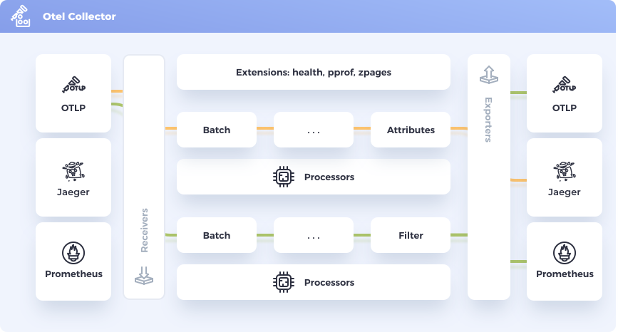
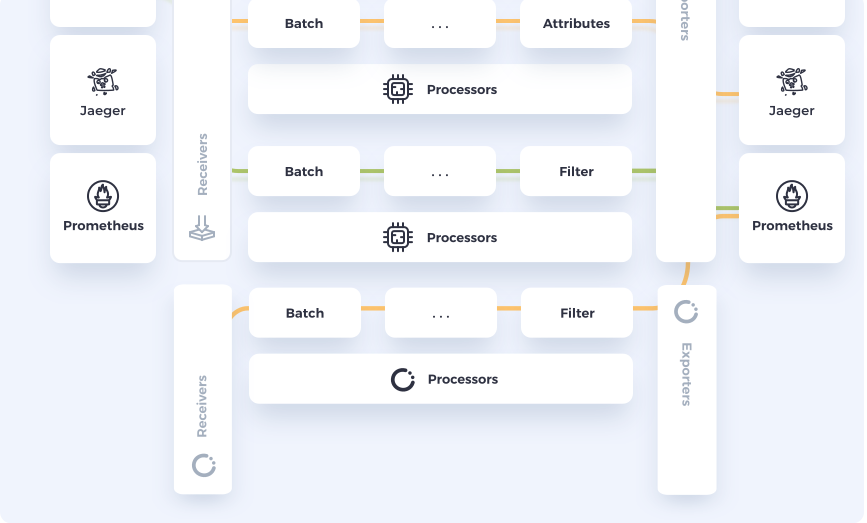

# OccamsHub OpenTelemetry Collector distribution


## Overview

OccamsHub OpenTelemetry Collector distribution, is an OccamsHub
version of the upstream __OTEL Collector__ to send telemetry data, Metrics, Logs and
Trances to supported backends which includes core, contrib and custom components.

**What is the OTEL Collector?**

_OTEL Collector_ is a vendor-agnostic implementation to receive, process and export
telemetry data. It removes the need to maintain multiple agents/collectors, and
it can act as an agent or a collector.


*fig.1: [OTEL Collector figure](https://github.com/open-telemetry/opentelemetry.io/blob/main/iconography/Otel_Collector.svg) by [OpenTelemetry](https://opentelemetry.io/) is licensed under [CC BY 4.0](https://creativecommons.org/licenses/by/4.0/)*

## OccamsHub's customization OTEL Collector

The __OccamsHub OTEL Collector distribution__ (__Occams Collector__), is a customized version of the __OTEL Collector__. The 
distribution is a wrapper around upstream __OTEL Collector__ core and contrib repositories with
some custom components added. These custom components can be added without changing the core
code (fig. 2).


*fig.2: Illustrates how OTEL Collector can be extended without touching core code*

## Occams Collector built-in components

This is the list for the included components in this distribution, referencing their
upstream repositories:

| Receiver                                                                                                                                  | Processor                                                                                                                                                | Exporter                                                                                                                      |
|-------------------------------------------------------------------------------------------------------------------------------------------|----------------------------------------------------------------------------------------------------------------------------------------------------------|-------------------------------------------------------------------------------------------------------------------------------|
| [otlpreceiver](https://github.com/open-telemetry/opentelemetry-collector/tree/main/receiver/otlpreceiver) otlpreceiver (core)             | [batchprocessor](https://github.com/open-telemetry/opentelemetry-collector/tree/main/processor/batchprocessor) (core)                                    | [loggingexporter](https://github.com/open-telemetry/opentelemetry-collector/tree/main/exporter/loggingexporter) (core)        |
| [prometheusreceiver](https://github.com/open-telemetry/opentelemetry-collector-contrib/tree/main/receiver/prometheusreceiver) (contrib)   | [memorylimiterprocessor](https://github.com/open-telemetry/opentelemetry-collector/tree/main/processor/memorylimiterprocessor) (core)                    | [otlpexporter](https://github.com/open-telemetry/opentelemetry-collector/tree/main/exporter/otlpexporter)  (core)             |
| [hostmetricsrecevier](https://github.com/open-telemetry/opentelemetry-collector-contrib/tree/main/receiver/hostmetricsreceiver) (contrib) | [attributesprocessor](https://github.com/open-telemetry/opentelemetry-collector-contrib/tree/main/processor/attributesprocessor) (contrib)               | [otlphttpexporter](https://github.com/open-telemetry/opentelemetry-collector/tree/main/exporter/otlphttpexporter) (core)      |
| [dockerstatsreceiver](https://github.com/open-telemetry/opentelemetry-collector-contrib/tree/main/receiver/dockerstatsreceiver) (contrib) | [resourcedetectionprocessor](https://github.com/open-telemetry/opentelemetry-collector-contrib/tree/main/processor/resourcedetectionprocessor) (contrib) | [fileexporter](https://github.com/open-telemetry/opentelemetry-collector-contrib/tree/main/exporter/fileexporter) (contrib)   |
| [filelogreceiver](https://github.com/open-telemetry/opentelemetry-collector-contrib/tree/main/receiver/filelogreceiver) (contrib)         |                                                                                                                                                          | [kafkaexporter](https://github.com/open-telemetry/opentelemetry-collector-contrib/tree/main/exporter/kafkaexporter) (contrib) |
| [jaegerreceiver](https://github.com/open-telemetry/opentelemetry-collector-contrib/tree/main/receiver/jaegerreceiver) (contrib)           |                                                                                                                                                          |                                                                                                                               |
| [zipkinreceiver](https://github.com/open-telemetry/opentelemetry-collector-contrib/tree/main/receiver/zipkinreceiver) (contrib)           |                                                                                                                                                          |                                                                                                                               |
| [grypereceiver](receiver/grypereceiver) (OccamsHub custom)                                                                                |                                                                                                                                                          |                                                                                                                               |

### Occams Collector custom components

* [Grype Receiver](receiver/grypereceiver). Periodically scans filesystem path/s for vulnerabilities using
  [Grype](https://github.com/anchore/grype), an _Open Source_ vulnerability scanner for container images and 
  filesystems written in _Go_. It acts as a scrapper, so there is no more input than the configuration.

## Usage

__Occams Collector__ is meant to be used as an agent to collect your
telemetry data and export it to your preferred backend using any built-in exporter.

**Download**

To download the binary release, please go to [Releases](https://github.com/occamshub-dev/occamshub-otel-distr/releases)
page and download the latest version for OS and architecture of your choice.

**Configuration**

Configuration is set using a YAML file, as in any other _OTEL Collector_ distribution.
This settings file will define the data pipelines and the components used on those
pipelines. A sample config file [otel.yaml](otel.yaml) is also provided for reference
and testing purposes.

If you want to see complete configuration options for specific __OccamsHub__ component, you can
find it under [Receivers](receiver), Processors or Exporters sections.

**Run**

To start the collector, just provide the configuration file as a parameter, as in the
example below.

```bash
./occamscol_linux_x86_64 --config otel.yaml
```

## Build

This section is for developers. Users looking to simply run the _OTEL Collector_ 
should check out [Usage](#Usage) section.

**Dependencies**

* [Go](https://go.dev)
* [Make](https://www.gnu.org/software/make/)
* [Docker](https://www.docker.com/) (Optional: build docker image)

**Compile**

In order to build the OTEL Collector executable, just run this command:

```bash
make build
```

You will find the binaries under the `build` path.

```txt
build/
├── darwin
│   ├── occamscol_darwin_arm64
│   └── occamscol_darwin_x86_64
├── linux
│   ├── occamscol_linux_arm64
│   └── occamscol_linux_x86_64
└── windows
    └── occamscol_windows_amd64
```

**Customize**

Checkout [otelcol-builder.yaml](otelcol-builder.yaml) file to know which components are
built-in by default. If you want to include or exclude components, edit this file and
run this command:

```bash
make regen build
```

In case you want to change some OccamsHub component, you will need to add some replaces
as this at the end of the [otelcol-builder.yaml)](otelcol-builder.yaml) file:

```yaml
replaces:
  - github.com/occamshub-dev/occamshub-otel-distr/receiver/grypereceiver => ./receiver/grypereceiver
```

**Build docker image**

To create a docker image compatible with official OpenTelemetry images,
run this command:

```bash
IMAGE_NAME=occamshub-otelcol make docker-build
```
You can change the image name to whatever you want.

## Useful links

### OccamsHub

* [OccamsHub Website](https://occamshub.com)
* [OccamsHub Blog](https://blog.occamshub.com)
* [OccamsHub Slack](https://occamshub.slack.com)

### External links

* [OpenTelemetry Collector @ github.com](https://github.com/open-telemetry/opentelemetry-collector)
* [OpenTelemetry Collector Contrib @ github.com](https://github.com/open-telemetry/opentelemetry-collector-contrib)

## Future

* Add `.deb` and `.rpm` packages.
* Add CI/CD pipeline.
* Serve docker images for pulling.

## License

```txt
Copyright 2021 OccamsHub Inc

Licensed under the Apache License, Version 2.0 (the "License");
you may not use this file except in compliance with the License.
You may obtain a copy of the License at

    http://www.apache.org/licenses/LICENSE-2.0

Unless required by applicable law or agreed to in writing, software
distributed under the License is distributed on an "AS IS" BASIS,
WITHOUT WARRANTIES OR CONDITIONS OF ANY KIND, either express or implied.
See the License for the specific language governing permissions and
limitations under the License.
```